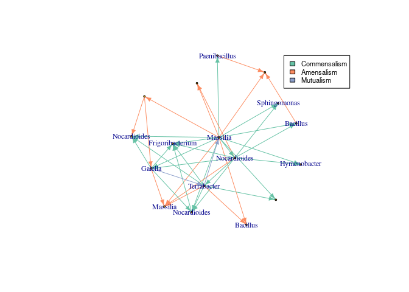

Tutorial
================

# What is InfIntE?

InfIntE stands for Inference of Interactions using Explainable machine
learning. This package uses abundance data to directly infer ecological
interactions using PyGol, an Abductive/Inductive logic program,
classified by their interaction type.

# Table of contents

1.  [Installation](#installation)
2.  [Example Data](#test)
3.  [Interaction Inference](#net)
4.  [Step by Step](#step)
5.  [Use of absolute data](#absl)

## Installation <a name="installation"></a>

InfIntE and required packages are installed using devtools

``` r
library(devtools)
if(!"InfIntE" %in% rownames(installed.packages())){
  install_github("didacb/InfIntE")
}
```

Interaction inference uses the logical inference process of abduction.
Abduction is performed using PyGol. PyGol is written in c. To compile
PyGol and obtain the functions for abduction run:

``` r
load_PyGol()
```

Currently PyGol only works in linux environments. It is necessary that
the following linux packages are installed to avoid problems of
compilation:

- cython
- python-dev

## Example Data <a name="test"></a>

We illustrate how InfIntE works using wheat foliar bacterial ASV data.
The data characteristics are detailed
[here](https://apsjournals.apsnet.org/doi/full/10.1094/PBIOMES-02-22-0008-FI).
The ASV data is in
[phyloseq](https://www.bioconductor.org/packages/release/bioc/html/phyloseq.html)
format. First, let’s import and subset the data to obtain a manageable
size.

``` r
#Import data
library(InfIntE)
library(phyloseq)

data("BCM_16S_wheat_phyloseq_filtered_lulu")
wheat_metadata<- sample_data(BCM_16S_wheat_phyloseq_filtered_lulu)

#Keep only green samples from march
selected_samples<- wheat_metadata$Date == "03_18" & 
                   wheat_metadata$Specie == "wheat" & 
                   wheat_metadata$Variety == "Apa" &
                  wheat_metadata$Tissue == "G" 

asv_subset<- prune_samples(selected_samples, BCM_16S_wheat_phyloseq_filtered_lulu) 

#Keep only the most abundant ASVs
asv_subset<- prune_taxa(taxa_sums(asv_subset)>2000, asv_subset)
```

The wheat bacterial community has many different bacterial genus
represented

``` r
library(ggplot2)
plot_bar(asv_subset, fill = "Genus")+theme(axis.text.x = element_blank())
```


## Interaction Inference <a name="net"></a>

To infer interactions, InfIntE offers a homonymous function to perform
the whole pipeline, from an OTU abundance table to abduced ecological
interactions, in a single run.

``` r
library(igraph)
#Infer interactions
interactions<- infinte(otu_tb = data.frame(otu_table(asv_subset, taxa_are_rows = T)),
                       exclusion = TRUE, ncores = 25, nperms = 50)

#Get network
network_graph<-graph_from_data_frame(interactions$selected_interactions)

#Change ASV names to genus
V(network_graph)$name<- data.frame(tax_table(asv_subset))[V(network_graph)$name,]$Genus

#Add color to different interactions
library(RColorBrewer)
colors_edges<- brewer.pal(5, "Set2")

E(network_graph)$color<- sapply(E(network_graph)$lnk, function(x){
                                  colors_edges[which(unique(E(network_graph)$lnk)==x)]    
                                })
#Plot
set.seed(123)
lay <- layout.kamada.kawai(network_graph)
plot(network_graph, layout=lay, vertex.size=2, 
     vertex.label.cex = 0.75, edge.arrow.size=0.5 )
```

<!-- -->

## Step by step <a name="steps"></a>

But, what does InfIntE do, exactly, to learn interactions? InfIntE uses
an hypothesis of interaction written as a logical relation between
OTU/ASV presence, abundance and effects, as changes in OUT/ASV
abundance.

``` r
hypothesis<- 
c("abundance(C1,C2,S1,up):-presence(C2,S2,yes)&presence1(C1,S2,no)&effect_up(S2,S1)",
  "abundance(C1,C2,S1,app):-presence(C2,S2,yes)&presence1(C1,S2,no)&effect_up(S2,S1)",
  "abundance(C1,C2,S1,down):-presence(C2,S2,yes)&presence1(C1,S2,no)&effect_down(S2,S1)",
  "abundance(C1,C2,S1,dis):-presence(C2,S2,yes)&presence1(C1,S2,no)&effect_down(S2,S1)")
```

It then transforms the ASV matrix into logic clauses related by the
hypothesis

``` r
# Join absolute and compositional data in a table
otu_data <- join_abundances(otu_tb=otu_table(asv_subset, taxa_are_rows = T),
                            absolute_abundance = NULL, depth = NULL)

# All possible pairs of samples
comparisons <- get_comparsions(length(otu_data$samp_names))


# Get head logic clauses
head_clauses <- lapply(rownames(otu_data$otu_tb), function(otu) {
    pos <- which(rownames(otu_data$otu_tb) == otu)
    abundances <- do.call(
      what = otu_data$abundance_function[pos],
      args = list(
        "otu_abundance" = otu_data$otu_tb[pos, , drop = FALSE],
        "comparisons" = comparisons, "depth" = otu_data$depth, "exclusion" = TRUE
      )
    )
    return(abundances)
  })

head_clauses <- unlist(head_clauses)

# Get Body logic clauses
body_clauses <- get_presence(otu_data)

head(body_clauses)
```

    ## [1] "presence(c1,s1,yes)." "presence(c2,s1,no)."  "presence(c3,s1,no)." 
    ## [4] "presence(c4,s1,no)."  "presence(c5,s1,yes)." "presence(c6,s1,no)."

Then, PyGol is used to generate the bottom clause and abduce the effects
on the OTU abundance caused by other ASVs. InfIntE renames the ASVs
during the abduction to optimize process.

``` r
# Produce bottom clause
bottom_clauses <- get_bottom_clause(otu_data = otu_data,
                                    head_clauses = head_clauses, 
                                    body_clauses = body_clauses)

# Abduce effects
abduced_effects <- abduce(bottom = bottom_clauses, hypothesis = hypothesis)

# Get I values
abduced_effects <- get_I_values(abduced_effects)#Infer interactions


head(abduced_effects)
```

    ##   sp1 sp2         lnk comp
    ## 1  s1  s1   effect_up 2546
    ## 2  s1 s10 effect_down   19
    ## 3  s1 s11 effect_down    5
    ## 4  s1 s12 effect_down 1204
    ## 5  s1 s13   effect_up  366
    ## 6  s1 s14 effect_down   59

To select interactions, InfIntE uses the
[pulsar](https://github.com/zdk123/pulsar) package to run the
[StARS](https://www.ncbi.nlm.nih.gov/pmc/articles/PMC4138724/) model
selection.

``` r
# Length observations
mx <- length(bottom_clauses$head)

# Lambda distribution
lambda <- pulsar::getLamPath(max = mx, min = 0, 50, FALSE)

# Pulsar execution
pulsar_output <- pulsar::pulsar(t(otu_data$otu_tb),
  fun = pulsar_infinte,
  fargs = list(lambda = lambda, bottom_clauses = bottom_clauses,
               hypothesis = hypothesis, exclusion = TRUE, otu_data = otu_data),
  rep.num = 50, lb.stars = TRUE, ub.stars = TRUE, thresh = 0.01, ncores = 25,
)

# Format output to dataframe
fitted_model <- pulsar::refit(pulsar_output, criterion = "stars")
interactions <- data.frame(igraph::get.edgelist(
                    igraph::graph_from_adjacency_matrix(fitted_model$refit$stars)))

head(interactions)
```

    ##    X1  X2
    ## 1 s10  s1
    ## 2 s11  s1
    ## 3 s16  s1
    ## 4  s4  s1
    ## 5  s8  s1
    ## 6 s16 s10

As a final step, InfIntE classifies the interactions by their type.

``` r
# Take values from abduced effects dataframe
interactions <- abduced_effects[paste0(abduced_effects[, 1], abduced_effects[, 2])
                                %in% paste0(interactions[, 1], interactions[, 2]), ]

# Classify and give back original names
interactions <- classify_interactions(interactions)
interactions <- return_names(interactions, otu_data$otu_names)


#Get network
network_graph<-graph_from_data_frame(interactions)

#Change ASV names to genus
V(network_graph)$name<- data.frame(tax_table(asv_subset))[V(network_graph)$name,]$Genus

#Add color to different interactions
library(RColorBrewer)
colors_edges<- brewer.pal(5, "Set2")

E(network_graph)$color<- sapply(E(network_graph)$lnk, function(x){
                                  colors_edges[which(unique(E(network_graph)$lnk)==x)]    
                                })

#Plot
set.seed(123)
lay <- layout.kamada.kawai(network_graph)
plot(network_graph, layout=lay, vertex.size=2, 
     vertex.label.cex = 0.75, edge.arrow.size=0.5 )
```

<!-- -->

## Use of absolute data <a name="absl"></a>

InfIntE can also use absolute abundance data, complementing the
compositional data obtained from eDNA. In this example we use the qPCR
measurements of the pathogen *Z. tritici* available in the metadata.

``` r
#Retrieve absolute abundance
absolute_abundance<- t(data.frame(sample_data(asv_subset))[,7,drop=FALSE])
absolute_abundance<- ifelse(is.na(absolute_abundance),0,absolute_abundance)
#Infer interactions
interactions<- infinte(otu_tb = otu_table(asv_subset, 
                                          taxa_are_rows = T), ncores = 25,
                      absolute_abundance = absolute_abundance, exclusion = TRUE)
#Get network
network_graph<-graph_from_data_frame(interactions$selected_interactions)
#Change ASV names to genus
zymo.pos<- grep("Zymoseptoria", V(network_graph)$name)

V(network_graph)$name<- data.frame(tax_table(asv_subset))[V(network_graph)$name,]$Genus
V(network_graph)$name[zymo.pos]<- "Zymoseptoria"
#Add color to different interactions
library(RColorBrewer)
colors_edges<- brewer.pal(5, "Set2")
E(network_graph)$color<- sapply(E(network_graph)$lnk, function(x){
                                  colors_edges[which(unique(E(network_graph)$lnk)==x)]})
#Plot
set.seed(123)
lay <- layout.kamada.kawai(network_graph)
plot(network_graph, layout=lay, vertex.size=2, 
     vertex.label.cex = 0.75, edge.arrow.size=0.5 )
```


